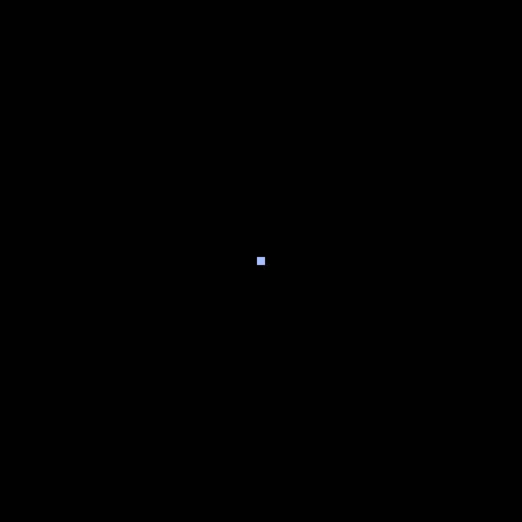

# Lines
> A logic game that was born in my head. The goal of the player is to fill as many space as possible, while trying to make closed spaces as much as possible.
> <p> Логическая игра, которая зародилась у меня в голове. Цель игрока - заполнить как можно больше территории, стараясь как можно чаще делать замкнутые пространства.

# Walls
> In the first line of the file, you can see variable "walls", by changing the value of which you can include walls. They do not give go out the center of their position, but they can be "eaten" if you go through them to this center from another position.
> <p> В самой первой строке файла вы можете увидеть переменную "walls", изменяя которую - вы можете включать и выключать стены. Они не дают вам выйти из центра своей позиции, однако их можно "съесть", если зайти в этот центр позиции из другой позиции.
# Control
> Arrows - Move.
> <br>Backspace - Restart game.
> <p> Стрелочки - передвижение.
> <br>Backspace - Перезапустить игру.
# Requirements
> To work the game requires a Pyxel library.
> <p>Для работы игры требуется библиотека Pyxel.
```
pip3 install pyxel
```
